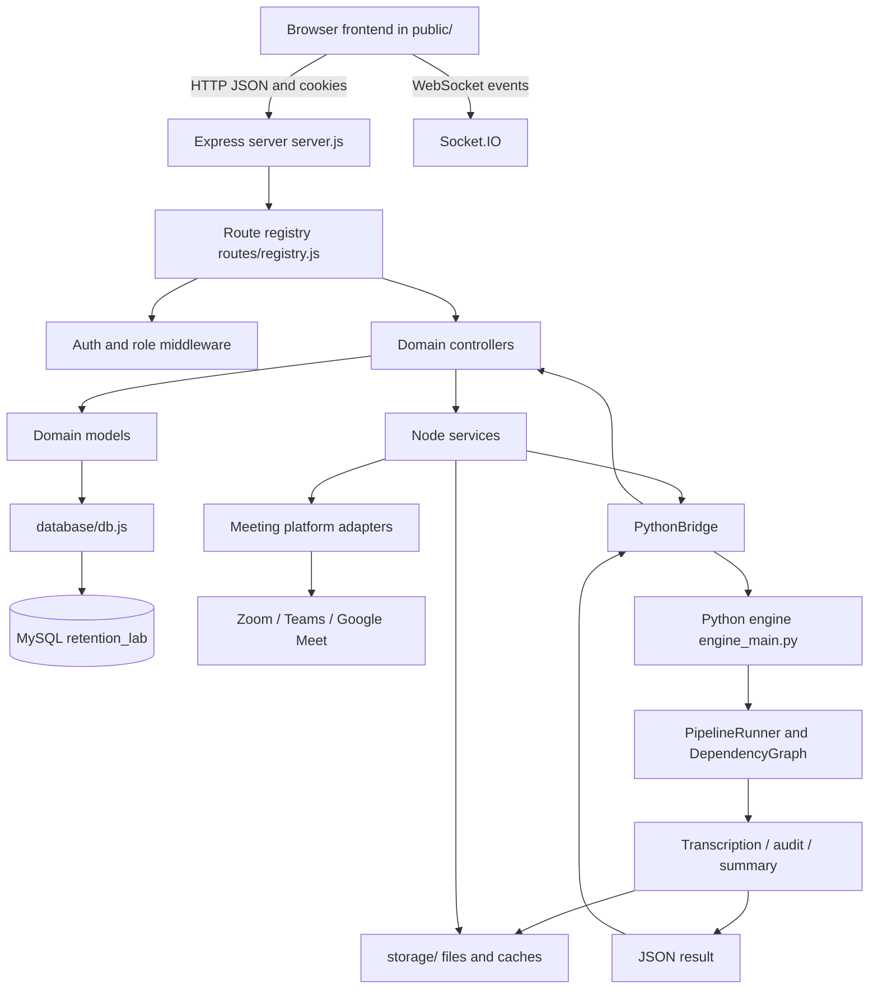

# RetentionLab Architecture and Development Process

## 1. Document Purpose

This document is the canonical high-level architecture reference for RetentionLab. It is written for developers and AI coding assistants that need to understand the project before changing code.

The repository is a full-stack meeting intelligence and retention platform. It combines:

- A Node.js and Express web/API server.
- Static HTML, CSS, and browser JavaScript frontend applications.
- MySQL persistence through `mysql2`.
- Meeting platform adapters for Zoom, Microsoft Teams, and Google Meet.
- A Python AI/media processing engine for audio, transcription, summaries, audits, and quality analysis (with on-demand speaker diarization).
- File-based runtime storage for recordings, transcripts, summaries, cache data, and screenshots.

This is an MVC-style application organized by business domain and user role.

## 2. Technology Stack

### Runtime

- Node.js: `package.json` requires Node 18 or newer.
- Python: the AI engine is executed through the configured Python executable or `.venv\Scripts\python.exe` on Windows.
- Operating-system tools: FFmpeg is required on `PATH` for media processing.

### Backend

- Express 4: HTTP server, middleware, static assets, and API routing.
- `socket.io`: real-time server communication.
- `cookie-parser`: authentication cookie parsing.
- `cors`: JSON/CORS middleware configuration.
- `dotenv`: environment configuration from `.env`.
- `jsonwebtoken`: JWT creation and verification.
- `nodemailer`: email delivery.
- `axios`, `fetch`, `googleapis`, and `google-auth-library`: external service and Google Calendar/OAuth integration.
- `puppeteer` and `puppeteer-stream`: browser automation, meeting joining, and media capture.
- `winston`: application logging.

### Database

- Primary runtime database: MySQL.
- Node database driver: `mysql2`.
- Database configuration is read from `DB_HOST`, `DB_PORT`, `DB_USER`, `DB_PASSWORD`, and `DB_NAME`.
- `database/db.js` exposes a compatibility facade with `get`, `all`, `run`, `prepare`, and `serialize` methods. This keeps older model calling conventions working while the runtime database is MySQL.
- `database/migrations/` contains schema migrations.
- `database/seeders/` contains ordered baseline seed data.
- `database/manual-seeder/` contains larger or scenario-specific test data scripts.
- `database/retentionlab.db` may exist as a local/legacy database artifact; do not assume it is the active production database without checking configuration.

### Python and AI

The Python engine dependencies include:

- PyTorch, TorchAudio, and optional CPU wheels.
- OpenAI Whisper, Faster Whisper, and WhisperX.
- `transformers`, `accelerate`, and `huggingface_hub` for model support.
- `openai` for LLM-backed analysis where configured.
- `ffmpeg-python` and system FFmpeg for media operations.
- `mysql-connector-python` for Python-side database access.
- `onnxruntime` and `python-dotenv` for runtime/model support.

## 3. Runtime Entry Points

### Main web server: `server.js`

`server.js` is the production application entry point.

Startup sequence:

1. Load `.env`.
2. Create the Express application and HTTP server.
3. Install JSON, cookie, CORS, and static-file middleware.
4. Serve `public/` as the frontend root and `storage/` at `/storage`.
5. Register routes through `routes/registry.js`.
6. Initialize the database through `database/db.js`.
7. Start queued-meeting bot polling.
8. Start periodic global calendar synchronization.
9. Listen on `PORT`, defaulting to `3000`.
10. Create a Socket.IO server for real-time communication.

The server also exports `{ app, io }` for tests or other Node consumers.

### Development/database readiness entry point: `index.js`

`index.js` initializes the database and keeps the process alive. It is not the main HTTP server. Use `server.js` or the `npm start` script for the application server.

### Python engine: `services/engine/engine_main.py`

The Python entry point accepts two positional arguments:

```text
python engine_main.py <input_file> <ai_settings_json>
```

It creates a `PipelineContext`, constructs a `PipelineRunner`, executes the configured task graph, and prints a JSON result.

### Node/Python bridge: `services/shared/pythonBridge.js`

The bridge:

1. Selects `PYTHON_EXECUTABLE`, the active virtual environment, `.venv`, or `python` as fallback.
2. Spawns Python with unbuffered output.
3. Passes the input media path and serialized AI settings.
4. Streams Python logs into Node logs.
5. Extracts the trailing JSON result from mixed process output.
6. Resolves meeting/session context when possible.
7. Persists generated asset paths and quality values through Node controllers/models.

## 4. High-Level Architecture



## 5. Request and Code Ownership Rules

Use these ownership rules before editing code:

- `server.js` owns application startup, middleware order, static serving, background loops, and route registration invocation.
- `routes/` owns URL paths and route-level composition. `routes/registry.js` is the central registration surface.
- `middleware/` owns authentication and authorization decisions.
- `controllers/` owns request handling, validation orchestration, response formatting, and coordination between models/services.
- `models/` owns persistence queries and domain data access.
- `database/` owns connection setup, migrations, seeders, and database lifecycle scripts.
- `services/` owns integrations, meeting automation, media processing coordination, Python bridging, and reusable business workflows.
- `services/engine/` owns Python pipeline execution and AI/media task implementation.
- `public/` owns frontend pages and browser-side behavior.
- `storage/` owns generated runtime artifacts; it is not the source-code layer.
- `utils/` owns cross-cutting helpers such as logging, exports, mail, calendar tokens, and transcript utilities.
- `config/settings.js` owns application and AI configuration assembled from environment variables and defaults.

Do not place database queries in route files when a model exists. Do not put business workflows into browser JavaScript when the server must enforce them. Do not make the Python engine responsible for Node HTTP response formatting.

## 6. Backend Request Lifecycle

A normal API request follows this path:

```text
Browser page
  -> public/js/*.js
  -> /api/... route
  -> optional requireAuth / requireRole middleware
  -> controller
  -> service and/or model
  -> database/db.js facade
  -> MySQL
  -> controller response
  -> browser JSON handling
```

The route registry groups the API by capability, including:

- Authentication, users, companies, roles, and departments.
- Meetings, meeting schedules, calendar integrations, and monitoring.
- Bot operations and platform automation.
- Transcripts, assets, archives, and content dashboards.
- Reviews, reviewers, scores, rubrics, and session quality.
- Audits, evaluation reports, team reports, and insights.
- Admin, instructor, reviewer, and super-admin dashboards.
- Header, sidebar, menu, and application configuration.

Page routes are registered last so API routes and explicit administrative pages take precedence over catch-all frontend routing.

## 7. Authentication and Authorization

`middleware/auth.js` is the central JWT helper.

- `signToken(user)` stores user identity, role, company, and email claims.
- `verifyToken(token)` validates the JWT.
- `requireAuth` accepts a Bearer token or `auth_token` cookie.
- Development/testing requests may provide `x-user-id`, `x-user-role`, and `x-user-company` headers when configured by the caller.
- `requireRole(...allowed)` enforces role names after authentication.

Authentication is an API/server concern. Frontend visibility controls are not sufficient security; protected endpoints must enforce authorization in middleware or controllers.

## 8. Meeting and Media Process

The meeting workflow is:

1. A user schedules or launches a meeting from an admin, instructor, or supported frontend page.
2. The API creates or updates meeting/session records.
3. The platform factory selects an adapter by platform name.
4. The adapter starts browser automation for Zoom, Teams, or Google Meet.
5. Bot services monitor the meeting, participants, captions, and recording state.
6. Audio, video, captions, and screenshots are written to configured storage paths.
7. Queued meetings are discovered by background polling in `server.js`.
8. Calendar events are refreshed by the periodic calendar sync loop.
9. A completed recording can be sent to the Python processing engine.
10. Python produces transcript, summary, audit, and quality outputs. (Speaker diarization is NOT part of this automatic flow — it is available on demand via the isolated `python_engine` or an AssemblyAI backend.)
11. Node parses the engine JSON result and updates meeting asset/session records.
12. Dashboards, reviewers, reports, and quality pages read the persisted results.

Supported platform adapters currently exposed by `services/platforms/platformFactory.js`:

- `zoom`
- `teams`
- `google-meet`

The factory mentions additional unsupported platform names in its error text; do not treat those names as implemented adapters unless a corresponding adapter exists.

## 9. Python Processing Pipeline

The Python engine is organized as a task-oriented pipeline.

Major engine areas:

- `media_service/`: audio extraction, chunking, merging, validation, normalization, waveform generation, metadata, FFmpeg, and file handling.
- `transcription_service/`: Whisper/WhisperX execution, language detection, timestamp alignment, transcript cleaning, speaker mapping, and transcript export.
- `live/`: live transcription, caption merging, real-time diarization, and streaming.
- `intelligence/`: actions, decisions, engagement, compliance, deadlines, interruptions, risks, participant statistics, and meeting scoring.
- `quality/`: confidence review, hallucination checks, transcript repair, and validation.
- `ai_api_service/`, `ai_audit_service/`, and `summary_service/`: service/worker boundaries for higher-level AI jobs.
- `orchestrator/`: pipeline context, task registry, dependency graph, runner, execution manager, runtime state, and task lifecycle.
- `task/`: task implementations for audit, cache, intelligence, media, runtime, summary, system, and transcription.
- `runtime/`, `cache/`, `distributed/`, `logging/`, and `shared/`: runtime support, resource management, caching, scheduling, diagnostics, logging, and shared result/config objects.

### Dependency graph behavior

The dependency graph filters tasks using feature flags from `PipelineContext`, checks dependencies, and identifies ready work. The intended core flow is:

```text
media
  -> transcription
      -> audit
      -> summary

 audit + summary
  -> persist_results
```

Diarization is NOT part of the automatic pipeline. It is a separate,
manual / on-demand process that runs only when explicitly invoked for a
chosen meeting/session.

### On-demand speaker diarization

Speaker diarization (speaker labeling + talk_ratio) is intentionally
decoupled from the automatic `media -> transcription -> [audit, summary] ->
persist_results` flow. It never runs as a pipeline task — not sequentially,
and not in parallel.

It is available on demand through the isolated `python_engine` (Whisper +
Resemblyzer) or via an AssemblyAI backend, and is not part of the automatic
pipeline.

Because it runs outside `PipelineRunner` / `DependencyGraph`, the automatic
pipeline never touches diarization, and diarization never blocks or delays
`audit`, `summary`, or `persist_results`.

## 10. Data and Storage Flow

### Database data

Use migrations to create or evolve tables, seeders for baseline application data, and manual seeders for realistic test scenarios. The database contains domains such as:

- Users, roles, permissions, companies, departments, and subscriptions.
- Calendar providers, integrations, OAuth credentials, and verification records.
- Meetings, sessions, participants, assets, recordings, and transcripts.
- Reviewers, reviews, scores, rubrics, and rubric assignments.
- Session analysis, quality reports, learning impact, coaching feedback, better alternatives, flags, and final evaluations.
- AI provider configuration and audit results.
- Header, sidebar, menu, page, and role configuration.

### Filesystem data

Generated files are stored under `storage/`, including recordings, transcripts, summaries, screenshots, cache artifacts, and browser profiles. File paths are recorded in database asset/session records when processing is associated with a known meeting and session.

Never commit secrets, tokens, recordings, generated logs, or large model/cache files. Use `.env.example` for configuration names and `.env` for local secrets.

## 11. Frontend Structure

The frontend is served as static files from `public/`.

- `public/admin/`: administrator workflows and session-quality pages.
- `public/instructor/`: instructor workflows.
- `public/reviewer/`: reviewer workflows.
- `public/super_admin/`: platform configuration and access-control workflows.
- `public/marketing/`: public marketing pages and partials.
- `public/js/`: shared and domain-specific browser logic.
- `public/css/`: shared and page/domain stylesheets.
- Root HTML files: authentication, shared header/sidebar, registration, password recovery, and verification pages.

Browser code should call the existing API routes and reuse the existing authentication/session conventions. Keep role-specific pages in their existing role directories.

## 12. Configuration and Environment

Configuration is split between:

- `.env`: local secrets and deployment-specific values; never document actual secret values.
- `.env.example`: safe configuration template.
- `config/settings.js`: application settings, AI settings, feature flags, storage paths, and runtime defaults.
- `database/db.js`: MySQL connection settings and pool behavior.
- `services/shared/config/`: Python/shared configuration helpers.

Important configuration categories include:

- HTTP port and environment.
- MySQL connection values.
- JWT secret and expiration.
- SMTP credentials.
- Google OAuth and calendar credentials.
- AI provider/model settings and Hugging Face token.
- Python executable and virtual environment.
- Recording, storage, FFmpeg, browser, and platform settings.

## 13. Development Workflow

Use this order for normal feature work:

1. Read this document and inspect the closest route, controller, model, service, or frontend page.
2. Confirm the owning layer before editing.
3. Add or update a migration when the database schema changes.
4. Add/update the model for persistence.
5. Add/update the controller for request orchestration.
6. Register the route in `routes/registry.js` when the endpoint is new.
7. Update the relevant frontend page and browser module.
8. For AI/media changes, update the Python task/service and confirm the Node bridge payload contract.
9. Seed representative data when the feature depends on records or permissions.
10. Run the narrowest relevant validation first.
11. Run broader checks only after the focused check passes.
12. Update this document when architecture, ownership, or process contracts change.

Useful commands:

```powershell
npm install
npm start
npm run dev
npm run db:init
npm run db:migrate
npm run db:seed
npm run db:manual-seed
npm run structure:update
python -c "import services.engine.engine_main as m; print('import_ok')"
node --check path\to\changed-file.js
```

For Python work, activate `.venv` first and install dependencies from `requirements.txt`. For media work, verify `ffmpeg -hide_banner -devices` succeeds.

## 14. Validation Checklist

Before declaring a change complete:

- The changed JavaScript parses with `node --check`.
- The changed Python module imports or its focused test passes.
- API routes are reachable through the registry and use the correct middleware.
- Protected endpoints reject missing or invalid authentication.
- Database queries use the model/database facade conventions.
- New migrations and seeders are ordered and idempotent where practical.
- Python bridge arguments remain exactly `[input_file, ai_settings_json]` unless both sides are changed together.
- Engine output still ends with a parseable JSON object.
- Generated media paths and database identifiers are handled when meeting/session context exists and skipped gracefully when it does not.
- Frontend pages use existing role and API conventions.
- No secrets or generated runtime artifacts are added to source control.
- `npm run structure:update` is run after structural changes.

## 15. AI Coding Assistant Contract

When an AI modifies this repository:

1. Start from the named file, failing command, route, symbol, or behavior.
2. Read the nearest owning implementation and one nearby test/call site.
3. State one local hypothesis about the behavior before editing.
4. Make the smallest change that tests that hypothesis.
5. Validate immediately with the narrowest executable check.
6. Preserve unrelated user changes in the worktree.
7. Keep public APIs, database compatibility methods, bridge argument order, and route registration conventions stable unless the task explicitly requires a contract change.
8. Do not invent new top-level architecture when an existing domain folder or service owns the behavior.
9. Do not assume a file listed in older documentation still exists; verify the live filesystem.
10. Update `ARCHITECTURE.md` when a lasting ownership or process rule changes.

## 16. Canonical Reference Files

- `server.js`: production runtime startup and background services.
- `package.json`: Node dependencies and commands.
- `config/settings.js`: application and AI configuration.
- `routes/registry.js`: centralized route registration.
- `middleware/auth.js`: JWT authentication and role checks.
- `database/db.js`: MySQL pool and model compatibility facade.
- `database/migrations/`: schema evolution.
- `database/seeders/`: baseline data.
- `services/shared/pythonBridge.js`: Node-to-Python contract.
- `services/engine/engine_main.py`: Python engine entry point.
- `services/engine/orchestrator/`: task graph and execution lifecycle.
- `services/engine/manual/run_diarization.py`: on-demand speaker diarization script (not part of the automatic pipeline).
- `public/`: browser UI.
- `storage/`: generated runtime artifacts.
- `project_structure_only.txt`: current file/folder inventory, regenerated with `npm run structure:update`.
